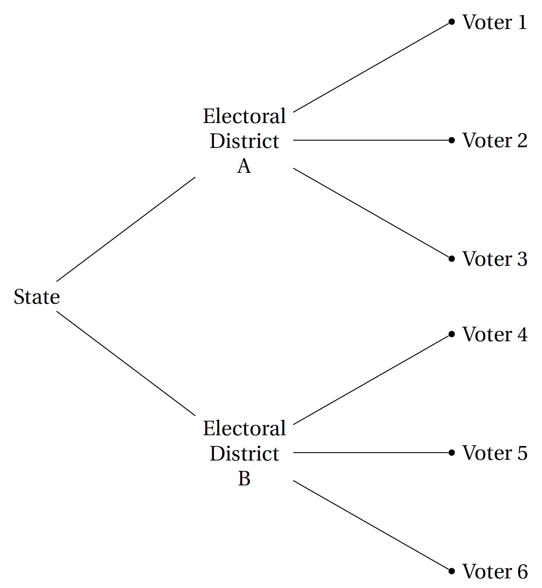
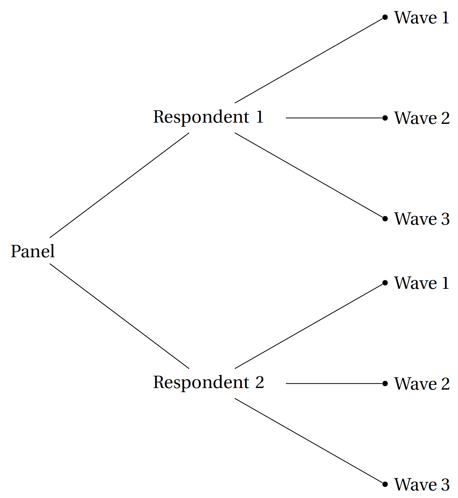
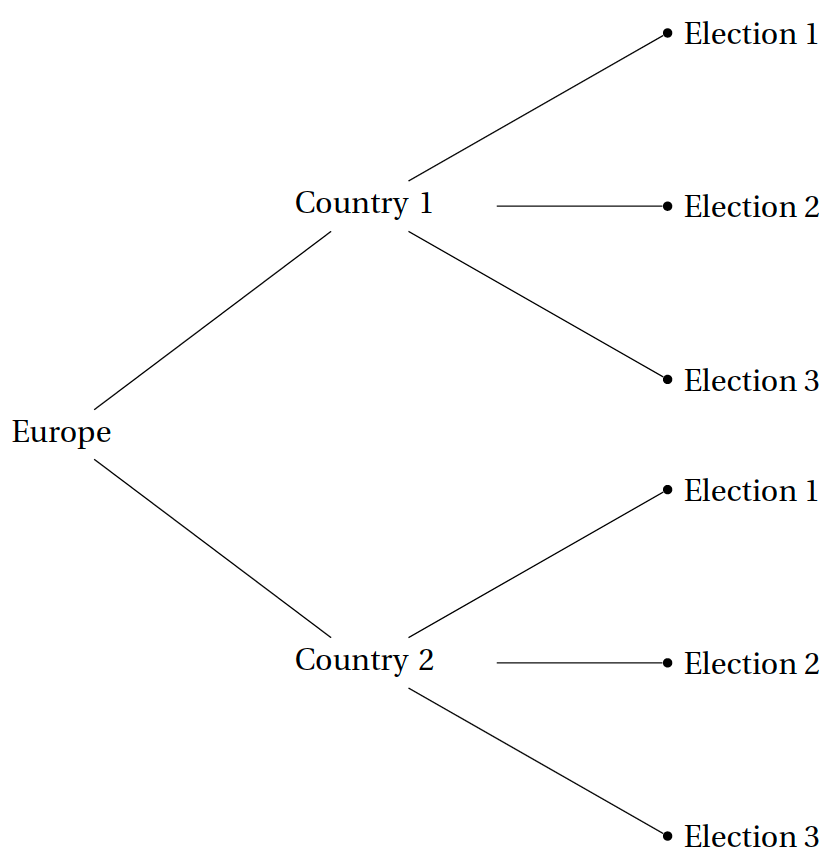

```{r setup}
# The first line sets an option for the final document that can be produced from
# the .Rmd file. Don't worry about it.
knitr::opts_chunk$set(echo = TRUE)

# First you define which packages you need for your analysis and assign it to 
# the p_needed object. 
p_needed <-
  c("viridis", "knitr", "MASS", "pROC", "nnet", "mlogit", "plm", "lme4")

# Now you check which packages are already installed on your computer.
# The function installed.packages() returns a vector with all the installed 
# packages.
packages <- rownames(installed.packages())
# Then you check which of the packages you need are not installed on your 
# computer yet. Essentially you compare the vector p_needed with the vector
# packages. The result of this comparison is assigned to p_to_install.
p_to_install <- p_needed[!(p_needed %in% packages)]
# If at least one element is in p_to_install you then install those missing
# packages.
if (length(p_to_install) > 0) {
  install.packages(p_to_install)
}
# Now that all packages are installed on the computer, you can load them for
# this project. Additionally the expression returns whether the packages were
# successfully loaded.
sapply(p_needed, require, character.only = TRUE)

load("raw-data/ward_macro_week12.Rdata")
```

---

## Before we get started

This is the final AQM 2025 lab session! we will host longer office hours in two weeks and (but none next week) if you want further advice for your term paper.

### Term Paper

Please upload your final term paper on ILIAS. The deadline is June, 19, 10:00 CEST.


The paper itself should be `lastname_lastname_AQM25.pdf` (`lastname_lastname_lastname_AQM25.pdf` if you are in a group of three). Your upload should include all code and data that is necessary to replicate your analysis. We highly recommend you to work as you did in the homeworks, i.e. in an R-project environment. If you do so, you can simply zip the folder of your Project and upload it.

---

## Program for today

In this session, we will learn about:

  1. Short recap of last week: fixed effects and what they are good for.
  2. Multi-level models.
  3. Simulate Qantities of Interest based on Multi-level models.
  4. How to choose between fixed effects models and multi-level models?
  5. *(If we have the time)* The best of both worlds? Within-Between Random Effect Models
  

---

## To get started: What was "nested" or "hierarchical" data again?

The terms "nested data structures", "hierarchical data structures", or "multilevel data structures" all describe the same thing: There are units of analysis in the data that are a subset of other units. You will soon notice that we encounter such structures all the time. For example, voters are nested in electoral districts (nested in states, nested in countries, ...)

Voters nestes in districts nested in states |  Panel waves nested in respondents
:-------------------------:|:-------------------------:
  |  

Given the ubiquity of such data structures, it is no surprise that a wide variety of approaches exist to anaylize respective data. This can make it difficult to figure out an appropiate approach for a specific research question. After today's session, you will know the key differences between the main approaches as well as their advantages and disadvantages. This will enable you to make an informed choice when you work with nested data and need to decide on a model.

## Data for today: Happiness and Voting

Like last week, we will work with data from an article by George Ward that appeared in the *American Journal of Political Science* in 2020.


Ward is interested in a quite straightforward question: *Is Happiness a Predictor of Election Results?*, or more specifically: *Do government parties get more votes the electorate is happy?* Ward uses observational data to find an answer to this question. He did both micro and macro level analyses. We will focus on the macro level analysis.

```{r}
load("raw-data/ward_macro_week12.Rdata")

head(dta)
```

We have the following variables:
  
  + `country` = country
  + `year` = election year
  + `vote_share_cab` = % votes won by cabinet parties
  + `vote_share_cab_tmin1` = % votes at previous election by cabinet
parties
  + `satislfe_survey_mean` = Life Satisfaction, Country-Survey mean (1-4 scale)
  + `parties_ingov` = Number of parties in government
  + `seatshare_cabinet` = % seats held by governing coalition
  + `cab_ideol_sd` = Gov Ideologial Disparity (Standard deviation of government party
left-right scale)
  + `ENEP_tmin1` = Party Fractionalisation - Last Election (Gallagher Fractionalization Index)

For this week, we added some additional country level variables:

  + `c_parliamentary`: Has the country a parliamentary or non-parliamentary system?
  + `c_bicameral`: Has the country a bicameral or unicameral system?
  + `c_unitary`: Has the country a unitary or federal/other system?
  
We will only work with the `c_parliamentary` variable, but you can play around with the others if you want to.

The data is time-series cross-section data: We observe multiple elections in different (European) countries, i.e. elections are nested in countries.



We already noted last week that this is a challenging research question because there may be unobserved and therefore ommitted confounding variables. Because the data structure is hierarchical, we can think of potential counfounders on the *country level (variables that vary between countries but not are constant over time)* and on the *election level (variables that vary within countries)*.

### A second look into fixed effects regression models

To motivate this session, let's start with the fixed effects regression model from last week and remind ourselves about the **advantages** and **disadvantages** of including fixed effects in our model.

For the sake of simplicity, we will start with the simple country fixed effects model:

```{r}
fe_1 <- lm(vote_share_cab ~ satislfe_survey_mean +
             as.factor(country),
           data = dta)

summary(fe_1)
```

We recognized that the research question posed by Ward (2020) was a difficult one because there might be unobserved confounding variables. This includes *time-invariant country level* confounders and *time-variant election level confounders*. Or if we phrase it more generally: Confounders that only vary between the higher level units of our data (countries) and those that also vary within the higher level units of our data (within countries, over time).

What are those fixed effects (i.e. country dummies) good for?

  + By including country fixed effects, we implicitely account for all (unobserved) time-invariant country level confounding variables!
  + Thus, fixed effects are a great tool if we worry about unobserved confounders that only vary between the higher level units of our data.
  + Note: fixed effects do not help with confounders that vary within the higher level units (time-varying confounders)! That's why Ward (2020) controls for additional election level variables:
  
```{r}
fe_2 <- lm(vote_share_cab ~ satislfe_survey_mean + 
             parties_ingov + seatshare_cabinet + cab_ideol_sd + ENEP_tmin1 +
             as.factor(dta$country),
           data = dta)

summary(fe_2)
```

Let's turn towards the disadvantage of fixed effects. By including country fixed effects, we entirely focus on the within country variation of our variables. More concretely, we analyse how **changes of happiness within countries** cause **changes of the cabinet party vote share within countries**. 

Even though this is great news for many research projects (we need to rely on fewer assumptions for causal identification!), two things are not possible anymore once we include country fixed effects:

  1. We cannot learn how **differences in vote share between countries** relates to higher or lower **vote shares of cabinet parties between countries**
  2. We cannot learn about the effect of higher level variables on our dependent variable anymore

To illustrate the second point, let's see what happens if we include a dummy variable that indicates whether a country has a parliamentary system or not (a time-invariant country level variable):

```{r}
fe_3 <- lm(vote_share_cab ~ satislfe_survey_mean + 
             parties_ingov + seatshare_cabinet + cab_ideol_sd + ENEP_tmin1 +
             as.factor(dta$country) +
             c_parliamentary,
           data = dta)

summary(fe_3)
```

Because we eliminated all higher level variation by including fixed effects, it is impossible to estimate the effect of higher level variables. `c_parliamentary` is perfectly collinear with the country dummies. So what to do?

Option 1 would be to go back to *complete pooling:*

```{r}
p1 <- lm(vote_share_cab ~ satislfe_survey_mean +
           c_parliamentary,
         data = dta)

summary(p1)
```

Now we get a coefficient: It seems that cabinet parties in those countries with parliamentary systems on average receive higher vote shares as compared to non-parliamentary systems (which are only France and Portugal in our data, both being semi-presidential).

Still, this approach is not optimal! When we used fixed effects, we estimated 15 intercepts, one for each country in our data. Now, we estimated two intercepts, one for countries with parliamentary systems and one for countries with non-parliamentary systems. The problem is, that there still may be systematic differences between those countries that are parliamentary and between those that are not. Right now we do not account for those differences at all. Essentially, we are in a dilemma:

  + If we do only include higher level variables but no fixed effects (*complete pooling*), then there might by systematic differences between the higher level units that confound our estimates. People often refer to this as higher level heterogeneity.
  + We can solve this problem by including fixed effects (*no pooling*), but then we cannot make use of higher level variance anymore and thus cannot include higher level variables.


## Multi-level models

First things first, multi-level models come with many different names, don't get confused by that:

  + Multi-level models
  + Hierarchical models
  + Random effect models
  + Mixed models
  
> A great resource for multi-level models is the book by Andrew Gelman and Jennifer Hill: Data Analysis Using Regression and Multilevel/Hierarchical Models.

Multi-level models offer a solution to this dilemma by offering a mix of both approaches. The literature refers to the underlying principal often as *partial pooling*. This makes sense in the following way:

  + Not accounting for higher level variation at all = *complete pooling*
  + Including fixed effects and thus eliminating all higher level variation = *no pooling*
  + A mix of both approaches = *partial pooling*
  
Broadly speaking, there are two sorts of multi-level models: Varying intercept and varying slope models. Varying slope models are closest to what we did so far, so we will start with them.

### Multi-level models I: *The varying intercept model*

What happens is the follows: Very similar to fixed effect models, we estimate one intercept for each country. The can be written as follows (but there are many ways to express this):

$$
y_{ij} = \alpha_{j[i]} + X_i\beta + \epsilon_{i}
$$
Once again, we need to focus on the indexation:

  + $i$ denotes individual observations. In our case, individual observations are elections.
  + $j$ denotes higher level groups, in our case countries.
  + $\alpha_{j[i]}$ are varying intercept. All observations $i$ that belong to group $j$ share the same intercept. Or in our case: All elections $i$ in country $j$ share the same intercept.
  + $X_i$ is a matrix of individual level predictors (in our case time-varying election level predictors). A countries' average level of happiness is such a predictor.
  
So far, this does not look too different from a fixed effects model, right? If we include country dummies, then we would also get one intercept for each country. What makes those "varying intercepts" (or "random effects") different from fixed effects is an assumption about their distribution:

$$
\alpha_j \sim N(\mu_{\alpha}, \sigma^{2}_{\alpha})
$$

We assume that all country-level intercepts are drawn from one common normal distribution. The mean of this distribution, $\mu_{\alpha}$, as well as the variance, $\sigma^{2}_{\alpha}$, are estimated based on the data. This has an important consequence: As you will see, it pulls the estimated intercepts towards the mean of the distribution. This is the difference between fixed and random effects! 

Let's see how this looks like in practice. In order to estimate a multi-level model, we use the `lme4` package:

```{r}
mlm_1 <- lmer(vote_share_cab ~ satislfe_survey_mean +
                (1 | country),
              data = dta)

summary(mlm_1)
```

We can access the country intercepts the following way:

```{r}
ranef(mlm_1)$country
```

To see the effect of the distributional assumption about the intercept in a multilevel model, let's plot the estimated intercepts that we get when we include country dummies (fixed effects), and those that we get in a multi-level model (random effects).

```{r, echo=F}
# raw intercepts from FE model
intercepts_fe_model <- c(coef(fe_1)["(Intercept)"],
                         coef(fe_1)["(Intercept)"] + coef(fe_1)[3:16])
# de-meaned distribution of intercepts
intercepts_fe_model <- intercepts_fe_model - mean(intercepts_fe_model)

# de-meaned intercepts of multi-level model
intercepts_mlm_model <- ranef(mlm_1)$country[,"(Intercept)"]

n_countries <- length(intercepts_fe_model)

# Plot
#par(mfrow = c(1, 2))
plot(x = 1:n_countries,
     y = intercepts_fe_model,
     ylim = c(-18, 18),
     col = viridis(3)[1],
     pch = 19,
     xaxt = "n",
     xlab = "",
     ylab = "De-meaned Intercepts",
     las = 1)
axis(1, at = 1:n_countries,
     labels = rownames(ranef(mlm_1)$country),
     las = 2)
abline(h = 0)
points(x = 1:n_countries,
       y = intercepts_mlm_model,
       col = viridis(3)[2],
       pch = 19)
legend("topright",
       pch = 19,
       col = viridis(3)[1:2],
       legend = c("FE Intercepts", 
                  "RE Intercepts"),
       bty = "n")

# Density of both distributions
plot(density(intercepts_fe_model),
     col = viridis(3)[1],
     lwd = 2,
     xlim = c(-18, 18),
     ylim = c(0, 0.06),
     yaxt = "n",
     ylab = "",
     xlab = "De-meaned intercept",
     main = "Distribution of Intercepts",
     font.main = 1)
lines(density(intercepts_mlm_model),
      col = viridis(3)[2],
      lwd = 2)
legend("topright",
       lwd = 2,
       col = viridis(3)[1:2],
       legend = c("FE Intercepts", 
                  "RE Intercepts"),
       bty = "n")
```

We see that assuming the country intercepts to be normally distributed pulls the estimated intercepts towards the mean of the distribution. 

Here are the regression lines of the three approaches we know now:

```{r}
# Plot

par(mfrow = c(1, 3))

# Complete Pooling

plot(x = dta$satislfe_survey_mean,
     y = dta$vote_share_cab,
     col = "grey80",
     main = "All data in one model\n(Complete Pooling)",
     font.main = 1,
     ylab = "Cabinet Party Vote Share in %",
     xlab = "Average life satisfaction",
     ylim = c(0,100),
     las = 1)
abline(lm(vote_share_cab ~ satislfe_survey_mean, data = dta))

# Multilevel Model
intercepts_mlm_model <- 
  fixef(mlm_1)["(Intercept)"] + ranef(mlm_1)$country[,"(Intercept)"]
plot(x = dta$satislfe_survey_mean,
     y = dta$vote_share_cab,
     col = "grey80",
     main = "Multilevel Model\n(Partial Pooling)",
     font.main = 1,
     ylab = "Cabinet Party Vote Share in %",
     xlab = "Average life satisfaction",
     ylim = c(0,100),
     las = 1)
# add regression lines for each country
for (i in 1:length(intercepts_mlm_model)) {
  abline(a = intercepts_mlm_model[i],
         b = fixef(mlm_1)["satislfe_survey_mean"])
}

# Fixed Effects Models

plot(x = dta$satislfe_survey_mean,
     y = dta$vote_share_cab,
     col = "grey80",
     main = "Fixed Effects Model\n(No Pooling)",
     font.main = 1,
     ylab = "Cabinet Party Vote Share in %",
     xlab = "Average life satisfaction",
     ylim = c(0, 100),
     las = 1)
# add regression lines for each country
intercepts_fe_model <- c(coef(fe_1)["(Intercept)"],
                         coef(fe_1)["(Intercept)"] + coef(fe_1)[3:16])
for (i in 1:length(intercepts_mlm_model)) {
  abline(a = intercepts_fe_model[i],
         b = coef(fe_1)["satislfe_survey_mean"])
}
```

Note that because we are talking about "varying **intercept**" models, the expression "no pooling" and "partial pooling" only refers to the intercept. We estimate only one slope, so all the lines are parallel. We will look at the "no pooling" and "partial pooling" with respect to the intercept **and** slope later.

#### Including group-level predictors

The consequence of the partial pooling approach (i.e. of using multi-level models) is that we do not eliminate all higher level variation! There is variation between countries left which enables us to include higher level variables (such as parliamentarism). Let's do this:

```{r}
mlm_2 <- lmer(vote_share_cab ~ satislfe_survey_mean +
                c_parliamentary +
                (1 | country),
              data = dta)

summary(mlm_2)
```

We are now able to estimate an effect of `c_parliamentary`, even though we have an intercept for each individual country. You can think of this effect as one that aims to expain the variation of the intercepts you see in the plots above. Noteably, the effect is different compared to the one in the pooled model. It still has the same direction, but appears to be smaller in magnitude and it comes with much more uncertainty.

Let's have a look at what is going on in both models:

```{r, echo=F}
# store varying intercepts in a data frame
country_dta_tmp <- data.frame("country" = rownames(ranef(mlm_2)$country),
                              "ranef" = ranef(mlm_2)$country[, "(Intercept)"])

# add c_parliamentary variable 
country_dta_tmp$c_parliamentary <- 
  dta$c_parliamentary[match(country_dta_tmp$country, dta$country)]

# (1) complete pooling regression
par(mfrow = c(1, 2))
plot(x = jitter(dta$c_parliamentary),
     y = dta$vote_share_cab,
     main = "Pooled Regression",
     font.main = 1,
     col = viridis(3, 0.75)[dta$c_parliamentary+1],
     pch = 19,
     xlab = "",
     xaxt = "n",
     ylab = "Cabinet parties vote share in %",
     las = 1)
axis(1, at = 0:1,
     labels = c("non-parl.", 
                "parl."))
abline(a = coef(p1)["(Intercept)"], 
       b = coef(p1)["c_parliamentary"],
       col = viridis(3)[3],
       lwd = 3)


# (2) higher level in multi-level model
plot(x = jitter(country_dta_tmp$c_parliamentary),
     y = country_dta_tmp$ranef,
     main = "Country-level multi-level model",
     font.main = 1,
     col = viridis(3, 0.75)[country_dta_tmp$c_parliamentary+1],
     pch = 19,
     ylim = c(-10, 10),
     xlab = "",
     xaxt = "n",
     ylab = "De-meaned country level intercepts",
     las = 1)
axis(1, at = 0:1,
     labels = c("non-parl.", 
                "parl."))
abline(a = 0, b = fixef(mlm_2)["c_parliamentary"],
       col = viridis(3)[3],
       lwd = 3)
```

### Multi-level models II: *The varying intercept and varying slope model*

So far, the terms "no pooling", "complete pooling" and "partial pooling" referred to the intercept. But a true "no pooling" approach would not only mean to give each country its own intercept, we would also want to estimate a separate slope for each country. If by "no pooling" we really mean that we don't throw the data of one country into the same pool as the data of another country, then we need to estimate intercepts and slopes for each country separately.

We can take this logic and apply it to the "partial pooling" approach of multi-level models. In the same way as we can allow intercepts to vary over higher level units (i.e. over countries), we can also allow effect coefficients (slopes) to vary over higher level units. Formally, this would look like the following:

$$
y_{ij} = \alpha_{j[i]} + \beta_{j[i]}x_i + \epsilon_{i}
$$

Because we now have two varying coefficients, varying intercepts and varying slopes, we assume that they follow a multivariate normal distribution:

$$
\begin{pmatrix}
      \alpha_j \\
      \beta_j \\
\end{pmatrix}  \sim N 
\begin{pmatrix}
\begin{pmatrix}
      \mu_\alpha \\
      \mu_\beta \\
\end{pmatrix}, 
\begin{pmatrix}
      \sigma^{2}_{\alpha} & \rho \sigma_\alpha \sigma_\beta \\
      \sigma_\alpha \sigma_\beta & \sigma^{2}_{\beta}
\end{pmatrix}
\end{pmatrix}
$$

In practice, we could allow the effect of average happiness to vary between countries:

```{r}
mlm_3 <- lmer(vote_share_cab ~ satislfe_survey_mean +
                c_parliamentary +
                (1 + satislfe_survey_mean | country),
              data = dta)

summary(mlm_3)
ranef(mlm_3)
```

Let's plot the effects by country (without uncertainty)

```{r}
intercepts_mlm3 <- 
  fixef(mlm_3)["(Intercept)"] + 
  ranef(mlm_3)$country[,"(Intercept)"] + 
  country_dta_tmp$c_parliamentary*fixef(mlm_3)["c_parliamentary"]

slopes_mlm3 <- 
  fixef(mlm_3)["satislfe_survey_mean"] +
  ranef(mlm_3)$country[,"satislfe_survey_mean"]


# country colors
country_dta_tmp$col <- 1:nrow(country_dta_tmp)
dta$country_col <- country_dta_tmp$col[match(dta$country,
                                             country_dta_tmp$country)]

# Plot

plot(x = dta$satislfe_survey_mean,
     y = dta$vote_share_cab,
     col = "grey80",
     main = "Varying-slope varying-intercept model",
     font.main = 1,
     ylab = "Cabinet Party Vote Share in %",
     xlab = "Average life satisfaction",
     las = 1)
# add regression lines for each country
for (i in 1:length(intercepts_mlm3)) {
  abline(a = intercepts_mlm3[i],
         b = slopes_mlm3[i])
}

```
Let's compare this to the full pooling, and to the no pooling approach where each country gets its own regression:

```{r}
no_pooling_res <- data.frame("country" = unique(dta$country),
                             "int" = NA,
                             "slope" = NA)

for (i in 1:nrow(no_pooling_res)) {
  no_pooling_res[i, c("int", "slope")] <-
    coef(lm(vote_share_cab ~ satislfe_survey_mean, 
            data = dta[dta$country == no_pooling_res$country[i],]))
}

# Plot

par(mfrow = c(1, 3))

# Complete Pooling

plot(x = dta$satislfe_survey_mean,
     y = dta$vote_share_cab,
     col = "grey80",
     main = "All data in one model\n(Complete Pooling)",
     font.main = 1,
     ylab = "Cabinet Party Vote Share in %",
     xlab = "Average life satisfaction",
     ylim = c(0,100),
     las = 1)
abline(lm(vote_share_cab ~ satislfe_survey_mean, data = dta))

# Multilevel Model

plot(x = dta$satislfe_survey_mean,
     y = dta$vote_share_cab,
     col = "grey80",
     main = "Multilevel Model\n(Partial Pooling)",
     font.main = 1,
     ylab = "Cabinet Party Vote Share in %",
     xlab = "Average life satisfaction",
     ylim = c(0,100),
     las = 1)
# add regression lines for each country
for (i in 1:length(intercepts_mlm3)) {
  abline(a = intercepts_mlm3[i],
         b = slopes_mlm3[i])
}

# Individual Models

plot(x = dta$satislfe_survey_mean,
     y = dta$vote_share_cab,
     col = "grey80",
     main = "Individual Regressions\n(No Pooling)",
     font.main = 1,
     ylab = "Cabinet Party Vote Share in %",
     xlab = "Average life satisfaction",
     ylim = c(0, 100),
     las = 1)
# add regression lines for each country
for (i in 1:nrow(no_pooling_res)) {
  abline(a = no_pooling_res$int[i],
         b = no_pooling_res$slope[i])
}

```


As you can see: While the no-pooling approach has advantage for the intercept (everything we learned about fixed effects regression), it often does not make sense to apply it to the slope. It is clear that our results are all over the place and this is because there is simply not enough data per country to estimate meaningful regression lines. If we still want to allow the slopes to vary between countries, Multi-Level Models offer a great solution.

### Simulate Quantities of Interest

The plot above nicely shows how countries now vary in both their intercept and their slope. However, we learn little about the uncertainty that comes with our estimation. To resolve this, let's simulate expected values of cabinet party vote shares in *Ireland over a range of values of life satisfaction*.

We will simulate based on the "fixed" part of our model and will later just add the random effects.

```{r}
nsim <- 10000

# Step 1: Get the regression coefficients
#   NOTE: We are only using fixed effects
beta_hat <- fixef(mlm_3)

# Step 2: Generate sampling distribution

# Step 2.1: Get the variance-covariance matrix.
V_hat <-  vcov(mlm_3)

# Step 2.2: Draw from the multivariate normal distribution.
S <- mvrnorm(nsim, beta_hat, V_hat)

# Additional Step 2.3: Add random effects

# varying intercept
S[, "(Intercept)"] <- 
  S[, "(Intercept)"] + 
  ranef(mlm_3)$country["IRL", "(Intercept)"]
# varying slope
S[, "satislfe_survey_mean"] <- 
  S[, "satislfe_survey_mean"] + 
  ranef(mlm_3)$country["IRL", "satislfe_survey_mean"]


# Step 3: Choose interesting covariate values. 
# Make sure the matrix multiplication also works for single scenarios
min_lifesat <- min(dta$satislfe_survey_mean[dta$country == "IRL"])
max_lifesat <- max(dta$satislfe_survey_mean[dta$country == "IRL"])
lifesatis_seq <- seq(min_lifesat, max_lifesat,
                     length.out = 100)

scenario <- cbind(1, lifesatis_seq, 1)

# Step 4: Calculate Quantities of Interest - 
# Expected Values
EV <- S %*% t(scenario)

# Step 5: Summarize
ev_mean <- apply(EV, 2, mean)
ev_ci <- apply(EV, 2, quantile, c(0.025, 0.975))
```

Let's plot it!

```{r}
plot(x = lifesatis_seq,
     y = ev_mean,
     ylim = c(35, 50),
     type = "l",
     lwd = 1.5,
     main = "Life satisfaction and cabinet party vote share in Ireland",
     font.main = 1,
     ylab = "Expected value of cabinet party vote share",
     xlab = "Average life satisfaction",
     las = 1)
lines(x = lifesatis_seq,
      y = ev_ci["2.5%",],
      lty = "dashed",
      lwd = 1.5)
lines(x = lifesatis_seq,
      y = ev_ci["97.5%",],
      lty = "dashed",
      lwd = 1.5)


```

### Exercise: Replicate the plot from above, but use three different countries of your choice for the simulation!

```{r}

```


## Summary: Multi-level model, fixed effects, or complete pooling--how to choose?

So we know now about fixed effects models, complete pooling, and multi-level models (which are also called random effect models). The question is: How to decide which model to use?

Let's summarize the advantages and disadvantages of the approaches.

#### Advantages of fixed effects models:
  
  + We do not have to worry about unobserved higher level confounders anymore (variables that only vary at the higher level, e.g. time-invariant country level variables). This is very valuable if your main goal is causal inference.
  
#### Disadvantage of fixed effects models:

  + We lose all the information that is stored at the higher level. If we are interested in explaining differences between countries or want to use the differences between countries to estimate our effect, then this does not work with fixed effects.
  
#### Advantages of complete pooling:

  + Including fixed effects means loosing all the higher level variance. Complete pooling allows us to make use of the higher level variance and analyse it.
  
#### Disadvantage of complete pooling:

  + In many applications, there are very likely unobserved confounders on the higher level. For causal effect estimation, complete pooling means to assume that there are no relevant differences between the higher level units--an assumption that is often times very unlikely to be true. Even more, complete pooling relies on the assumption that observations within the higher level units (e.g. within countries) are independet of one another. This is also very often unlikely to be true. Think about what those assumptions mean in your context!
  
#### Advantages of random effects (multi-level models):

  + We are able to account for differences between higher level units and at the same time are able to include higher level variables. 
  + Because we partition the total variation in higher and lower level variation, we can learn about both levels.
  + While fixed effects models are great for causal inference, Multi-level models are very good if your main goal is prediction (e.g. if you want to predict cabinet vote share in a specific country in the future).

#### Disadvantage of random effects (multi-level models):

  + Multi-level models do not help us in accounting for ommitted confounders on the higher level. If you are concerned about unobserved confounders on the higher level, then multi-level models won't do the job for you!
  
To choose, what we recommend is to think *carefully about what these points mean for your research question*. "Unobserved higher level confounder" is an abstract term, try to fill it with life! If you fear that this is a concern and you are interested in a causal effect where the treatment typically changes within your units over time, then fixed effects might be the better choice. If you have less concerns about unobserved confounders on the higher level but want learn from comparing you higher level units, then multi-level models might be better. 

But: It is important to phrase out what these things mean in your context! If you are able to do that, then you are able to make an informed choice.

## The best of both worlds? Within-Between Random Effect Models

This is just a teaser, but there is a smart model that combines fixed and random effects in a way that allows us to enjoy the benefits of both models. The *magic trick* is to enter the independent variable of interest in two different forms: In it's de-meaned form (which essentially gives us fixed effect estimates), and their group mean. 

This looks like the following:

$$
y_{ij} = \alpha_{j[i]} + \beta_1(x_{ij} - \bar{x_j}) + \beta_2\bar{x_j} + \epsilon_{ij}
$$

We have three things here:

  + $\beta_1(x_{ij} - \bar{x_j})$: the independent variable, life satisfaction, in it's de-meaned form
  + $\bar{x_j}$: the country means of the independent variable, life satisfaction
  + $\alpha_{j[i]}$ varying intercepts on the country level.


To implement this, we start by calculating the de-meaned form of our independent variable:

```{r}
# calculate group means (country means)
means_satis <- 
  aggregate(dta$satislfe_survey_mean,
            by = list(dta$country),
            FUN = mean)
names(means_satis) <- c("country", "mean")

# put them back into the data frame
dta$mean_satis <- 
  means_satis$mean[match(dta$country, means_satis$country)]

# calculate de-meaned variable:
dta$demeaned_satis <- dta$satislfe_survey_mean - dta$mean_satis
```

Now we can specify the following model

```{r}
rewb <- lmer(vote_share_cab ~ demeaned_satis + mean_satis +
                (1 | country),
              data = dta)

summary(rewb)
```

The coefficient $\beta_1$ will be exactly the same as the one that we get in a country fixed effects model. This is also called the *within* effect, because it is estimated with the variation wihtin countries (changes over time). The model thus enjoys all the advantages of fixed effects (no unobserved time-invariant confounder on the country level). To see this, compare the estimate with the simple fixed effects model:

```{r}
fe_1 <- lm(vote_share_cab ~ satislfe_survey_mean +
             as.factor(country),
           data = dta)

summary(fe_1)
```

Because we do not de-mean the dependent variable and include country level means as an independent variable, we also are able to analyse the higher level variance. So we can find out whether cabinet parties in countries that are on average *happier* than other countries receive higher vote shares. This information is given by $\beta_2$. This is also called the *between* effect, because it is estimated based on variation between countries.

```{r}
summary(rewb)
```

We see that the coefficient is positive and thus in line with the hypothesis--but comes with a lot of uncertainty. So we cannot make bold statements here.

If you want to read more about this model, we recommend the paper by [Bell and Jones (2015): Explaining Fixed Effects: Random Effects Modeling of Time-Series Cross-Sectional and Panel Data](https://www.cambridge.org/core/journals/political-science-research-and-methods/article/explaining-fixed-effects-random-effects-modeling-of-timeseries-crosssectional-and-panel-data/0334A27557D15848549120FE8ECD8D63).

## Concluding Remarks:

This was the final lab session! If you wish to speak to us about your term paper, we will be available during our regular office hours on Tuesday next week (and later if needed). Please book an appointment.

Thank you for your participation!


